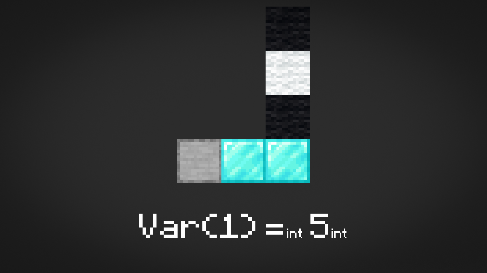
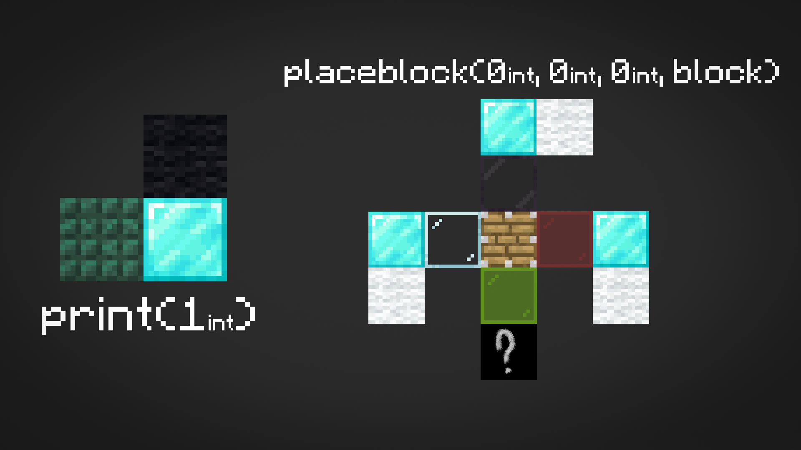
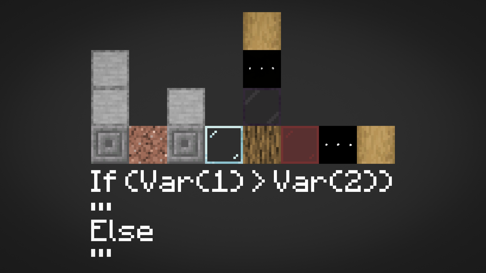
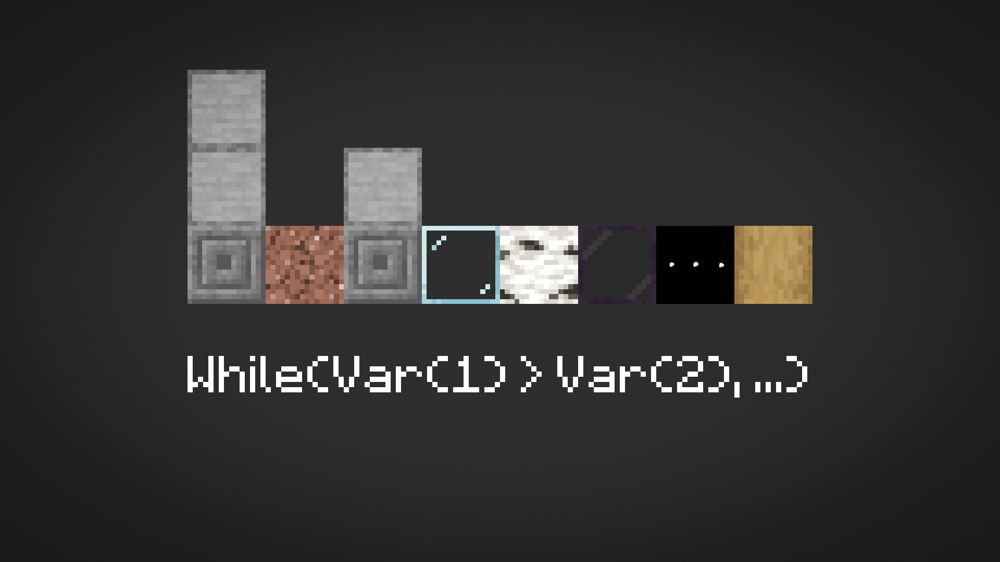
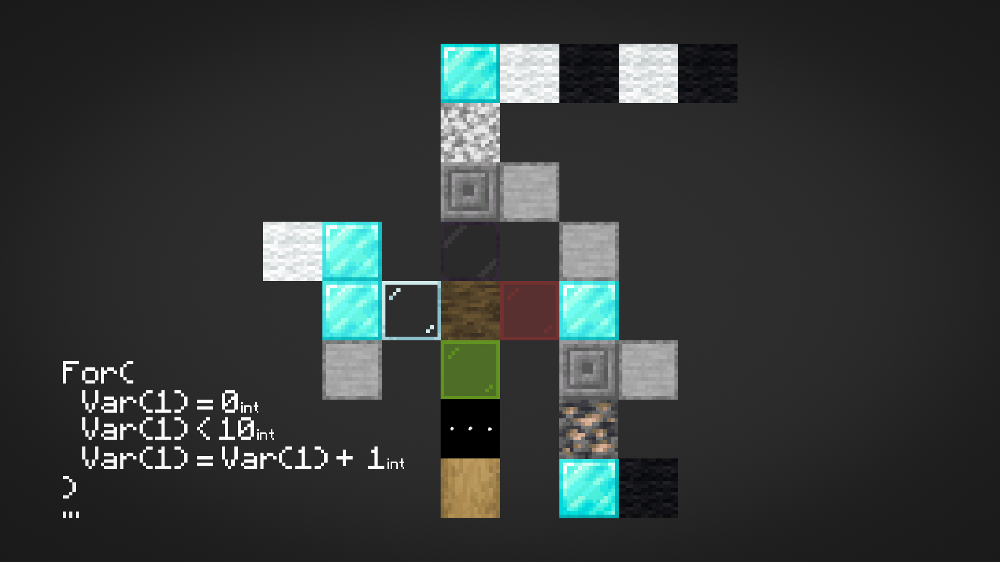
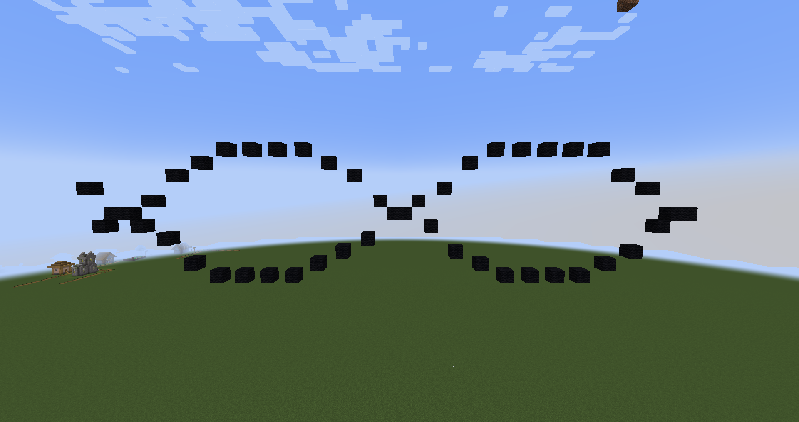

# LineBlock Documentation

LineBlock allows you to **program in Minecraft using blocks**.  
Each block represents a **command**, **operation**, or **value type**.  
Scripts are built directly in the world and executed visually — like a programmable redstone system.

---

## ✨ New Features

### 🧱 Custom Item Group  
All LineBlock-related blocks are grouped in their own **creative tab** —  
**“LineBlock”** — making it easy to find every functional block used for scripting.

### 💬 Tooltips  
Every LineBlock-compatible block now shows a **tooltip** describing its purpose and **value type** (e.g., `INT`, `FLOAT`, `BOOL`, etc.).  
This helps you quickly identify what each block does when hovering over it in the inventory.
 
### 🧩 New Command
Run your in-world scripts instantly with the **`/run`** command:

```
/run <x> <y> <z>
```

This command starts script execution from the block located at the specified coordinates —
allowing you to test or trigger LineBlock programs without manual activation.

---

## 👁️ Direction with Observer  
Script direction is determined using **Observers**.  
They define the **execution direction** — scripts run and place blocks relative to where the Observer is facing.

---

## 🔢 Bits

You need bits to type values in.

| Block | Value | Description |
|--------|--------|-------------|
| White Wool | `0` | Zero |
| Black Wool | `1` | One |

## 💾 Variables

| Block | Type | Description |
|--------|------|-------------|
| Diamond Block | `INT` | Integer variable |
| Gold Block | `FLOAT` | Floating-point variable |
| Iron Block | `STRING` | String variable |
| Emerald Block | `BOOL` | Boolean variable |
| Chiseled Stone Bricks | `use_var` | Access existing variable |
| Smooth Stone | `var_index` | Variable index reference |



### Caution!
Never write `VAR(1) = 1 + VAR(1)`. Parser can interpret it as `VAR(0) = 1 + VAR(2)`. Instead of this write `VAR(1) = VAR(1) + 1` or use brackets.

---

## 🧮 Math Operations

| Block | Operation | Description |
|--------|------------|-------------|
| Iron Ore | `+` | Addition |
| Copper Ore | `-` | Subtraction |
| Gold Ore | `*` | Multiplication |
| Redstone Ore | `/` | Division |
| Emerald Ore | `%` | Modulo |
| Lapis Ore | `^` | Power |
| Stripped Crimson Hyphae | `(` | Open parenthesis |
| Crimson Hyphae | `)` | Close parenthesis |

---

## ⚙️ Bitwise Operations

| Block | Operation | Description |
|--------|------------|-------------|
| Deepslate Iron Ore | `&` | Bitwise AND |
| Deepslate Copper Ore | `\|` | Bitwise OR |
| Deepslate Gold Ore | `^` | Bitwise XOR |
| Deepslate Lapis Ore | `~` | Bitwise NOT |
| Deepslate Redstone Ore | `<<` | Shift left |
| Deepslate Emerald Ore | `>>` | Shift right |

---

## 🔍 Logical Operations

| Block | Operation | Description |
|--------|------------|-------------|
| Nether Gold Ore | `AND` | Logical AND |
| Nether Quartz Ore | `OR` | Logical OR |
| Ancient Debris | `NOT` | Logical NOT |
| Netherrack | `XOR` | Logical XOR |

---

## ⚖️ Comparison Operations

| Block | Operation | Description |
|--------|------------|-------------|
| Stone | `==` | Equal |
| Deepslate | `!=` | Not equal |
| Granite | `>` | Greater than |
| Diorite | `<` | Less than |
| Andesite | `>=` | Greater or equal |
| Polished Andesite | `<=` | Less or equal |

---

## 📐 Math Functions

| Block | Function | Description |
|--------|-----------|-------------|
| White Glazed Terracotta | `sin(x)` | Sine |
| Light Gray Glazed Terracotta | `cos(x)` | Cosine |
| Gray Glazed Terracotta | `tan(x)` | Tangent |
| Black Glazed Terracotta | `asin(x)` | Arc Sine |
| Brown Glazed Terracotta | `acos(x)` | Arc Cosine |
| Red Glazed Terracotta | `atan(x)` | Arc Tangent |
| Orange Glazed Terracotta | `abs(x)` | Absolute value |
| Yellow Glazed Terracotta | `ceil(x)` | Round up |
| Lime Glazed Terracotta | `floor(x)` | Round down |

---

## 🔢 Constants

| Block | Constant | Description |
|--------|-----------|-------------|
| Green Glazed Terracotta | `π` | PI |
| Cyan Glazed Terracotta | `e` | Euler’s number |

---

## 🪟 Function Arguments

Some functions have multiple arguments (`if`, `for`, `while`, `placeblock`).

| Block | Argument |
|--------|------------|
| Glass | Argument 1 |
| Tinted Glass | Argument 2 |
| Red Stained Glass | Argument 3 |
| Lime Stained Glass | Argument 4 |

---

## ⚡ Commands

| Block | Command | Description |
|--------|-----------|-------------|
| Command Block | `command` | Executes a command |
| Dark Prismarine | `print` | Prints a value to the console |
| TNT | `stop` | Stops script execution |
| Piston | `placeblock` | Places a block in the world |



---

## 🧱 Control Structures

| Block | Structure | Description |
|--------|-------------|-------------|
| Oak Wood | `if` | Conditional block |
| Birch Wood | `while` | Loop while condition is true |
| Mangrove Wood | `for` | Loop structure |
| Obsidian | `break` | Break from loop |
| Crying Obsidian | `continue` | Skip to next loop iteration |
| Stripped Oak Wood | `block_end` | Ends a code block |







---

## 🧠 Example

Example script to **draw a sine wave** using `placeblock` and `for`:

### Script


### Result

